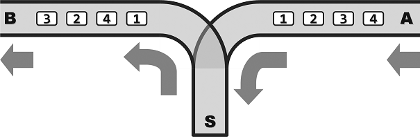

###Problem Description
#### Range Inquiry
Let S be a set of n integral points on the x-axis. For each given interval [a, b], you are asked to count the points lying inside.

* **Input**: The first line contains two integers: n (size of S) and m (the number of queries). The second line enumerates all the n points in S. Each of the following m lines consists of two integers a and b and defines an query interval [a, b].

* **Output**: The number of points in S lying inside each of the m query intervals.

* **Example**:
	* Input
	
			5 2
			1 3 7 9 11
			4 6
			7 12
	* Output
	
			0
			3
* **Restrictions**:

	- 0 <= n, m <= 5 * 10^5
	- For each query interval [a, b], it is guaranteed that a <= b.
	- Points in S are distinct from each other.
	- Coordinates of each point as well as the query interval boundaries a and b are non-negative integers not greater than 10^7.
	- Time: 2 sec
	- Memory: 256 MB

#### Zuma

Let's play the game Zuma!

There are a sequence of beads on a track at the right beginning. All the beads are colored but no three adjacent ones are allowed to be with a same color. You can then insert beads one by one into the sequence. Once three (or more) beads with a same color become adjacent due to an insertion, they will vanish immediately.

Note that it is possible for such a case to happen for more than once for a single insertion. You can't insert the next bead until all the eliminations have been done.

Given both the initial sequence and the insertion series, you are now asked by the fans to provide a playback tool for replaying their games. In other words, the sequence of beads after all possible eliminations as a result of each insertion should be calculated.

* **Input**: The first line gives the initial bead sequence. Namely, it is a string of capital letters from 'A' to 'Z', where different letters correspond to beads with different colors. The second line just consists of a single interger n, i.e., the number of insertions. The following n lines tell all the insertions in turn. Each contains an integer k and a capital letter Σ, giving the rank and the color of the next bead to be inserted respectively. Specifically, k ranges from 0 to m when there are currently m beads on the track.

* **Output**: n lines of capital letters, i.e., the evolutionary history of the bead sequence.
Specially, "-" stands for an empty sequence.

* **Example**:
	* Input
	 
			ACCBA
			5
			1 B
			0 A
			2 B
			4 C
			0 A
	* Output
	
			ABCCBA
			AABCCBA
			AABBCCBA
			-
			A
* **Restrictions**:

	* 0 <= n <= 10^4
	* 0 <= length of the initial sequence <= 10^4
	* Time: 2 sec
	* Memory: 256 MB

#### LightHouse
One lighthouse can only beacon its northeast and southwest direction. In other words, if we think the lighthouse is located at (0,0), it can beacon quadrants I and III.

* **Input**:
	* 1st line: N
	* 2nd ~ (N + 1)th line: each line is X Y, means a lighthouse is on the point (X, Y).

* **Output**: the number of pairs of lighthourses that can beacon each other. (For every lighthouses, X coordinates won't be the same , Y coordinates won't be the same.)

* **Example**:
	* Input
	
			3
			2 2
			4 3
			5 1
	* Output
	
			1
	 
* **Restrictions**:

	* For 90% test cases: 1 <= n <= 3 * 10^5
	* For 95% test cases: 1 <= n <= 10^6
	* For all test cases: 1 <= n <= 4 * 10^6
	* For every lighthouses, X coordinates won't be the same , Y coordinates won't be the same.
	* 1 <= x, y <= 10^8
	* Time: 2 sec
	* Memory: 256 MB
	
#### Train
The following figure shows the structure of a station for train dispatching.

In this station, A is the entrance for each train and B is the exit. S is the transfer end. All single tracks are one-way, which means that the train can enter the station from A to S, and pull out from S to B. Note that the overtaking is not allowed. Because the compartments can reside in S, the order that they pull out at B may differ from that they enter at A. However, because of the limited capacity of S, no more that m compartments can reside at S simultaneously.

Assume that a train consist of n compartments labeled {1, 2, …, n}. A dispatcher wants to know whether these compartments can pull out at B in the order of {a1, a2, …, an} (a sequence). If can, in what order he should operate it?

* **Input**: Two lines:

	- 1st line: two integers n and m;

	- 2nd line: n integers separated by spaces, which is a permutation of {1, 2, …, n}. This is a compartment sequence that is to be judged regarding the feasibility.

* **Output**: If the sequence is feasible, output the sequence. “Push” means one compartment goes from A to S, while “pop” means one compartment goes from S to B. Each operation takes up one line. If the sequence is infeasible, output a “no”.

* **Example**:
	* Input
			
			5 2
			1 2 3 5 4 
	* Output
	
			push
			pop
			push
			pop
			push
			pop
			push
			push
			pop
			pop
* **Restrictions**:
	* 1 <= n <= 1,600,000
	* 0 <= m <= 1,600,000
	* Time: 2 sec
	* Memory: 256 MB
	
#### BinTree Rebuild
In general, given the preorder traversal sequence and postorder traversal sequence of a binary tree, we cannot determine the binary tree.

But for one proper binary tree, in which each internal node has two sons, we can uniquely determine it through its given preorder traversal sequence and postorder traversal sequence.

Label n nodes in one binary tree using the integers in [1, n], we would like to output the inorder traversal sequence of a binary tree through its preorder and postorder traversal sequence.

* **Input**:
	* The 1st line is an integer n, i.e., the number of nodes in one given binary tree,
	* The 2nd and 3rd lines are the given preorder and postorder traversal sequence respectively.

* **Output**: The inorder traversal sequence of the given binary tree in one line.

* **Example**:
	* Input
	
			5
			1 2 4 5 3
			4 5 2 3 1
	* Output
	
			4 2 5 1 3
* **Restrictions**:
	* For 95% of the estimation, 1 <= n <= 1,000,00
	* For 100% of the estimation, 1 <= n <= 4,000,000
	* The input sequence is a permutation of {1,2...n}, corresponding to a legal binary tree.
	* Time: 2 sec
	* Memory: 256 MB
	

#### TSP
Shrek is a postman working in the mountain, whose routine work is sending mail to n villages. Unfortunately, road between villages is out of repair for long time, such that some road is one-way road. There are even some villages that can’t be reached from any other village. In such a case, we only hope as many villages can receive mails as possible.

Shrek hopes to choose a village A as starting point (He will be air-dropped to this location), then pass by as many villages as possible. Finally, Shrek will arrived at village B. In the travelling process, each villages is only passed by once. You should help Shrek to design the travel route.

* **Input**: There are 2 integers, n and m, in first line. Stand for number of village and number of road respectively. In the following m line, m road is given by identity of villages on two terminals. From v1 to v2. The identity of village is in range [1, n].

* **Output**: Output maximum number of villages Shrek can pass by.

* **Example**:
	* Input
	
			4 3
			1 4
			2 4
			4 3
		
	* Output

			3

* **Restrictions**:

	- 1 <= n <= 1,000,000
	- 0 <= m <= 1,000,000
	- These is no loop road in the input.
	- Time: 2 sec
	- Memory: 256 MB
	
#### Broadcast
A broadcast company needs to set up radio broadcasting launchers in an area. There are _n_ towns, each with a transmitter for different programs. However, the company is only authorized to use two bands, FM104.2 and FM98.6. The transmitters would interfere each other if using the same band.  

It is known that the signal coverage of each transmitter is circular with a radius of 20km, so if two towns with a distance less than 20km use the same band, they will fail to listen to the program because of band interferentce. Now given a list of towns with distances less than 20km, try to determine whether the company can make the whole area hear the broadcasts.

* **Input**: There are 2 integers, n and m, in first line. Stand for number of towns and number of pairs with distance less than 20km. In the following m line, each with 2 integers, which are the indices of towns with distance less than 20km. (The index starts from 1.)

* **Output**: If the requirements are met, output 1. Otherwise, output -1.

* **Example**:
	* Input
	
			4 3
			1 2
			1 3
			2 4
		
	* Output

			1

* **Restrictions**:

	- 1 <= n <= 10,000
	- 0 <= m <= 30,000
	- No need to worry about the towns' space locations.
	- Time: 2 sec
	- Memory: 256 MB

#### Temperature
A meteorological station collects temperature data every day from the around observation stations, and provides statistical query service for remote users through the internet. One of the most common types of queries is to compute the average temperature from observations in the rectangular area specified by the user. As more observatories are built, the scale of raw data expands dramatically. Besides, the frequency of the query is also increasing as the user community expands. So the goal is to improve the query efficiency by modifying data structures and algorithms.

Use a set of function interfaces provided by the  station, the server can access all the data has been collected and report the results.

* **Interface Directions**

		int GetNumOfStation(void)

The first function to be called, which returns the number of all observation stations _n_.

		void GetStationInfo(int no, int *x, int *y, int *temp)
		
Get the infomation of the _no_ th observation station, the location (*x, *y) and the temperature *temp. The measurement accuracy is unified with 0.01℃ as the reference unit, for example, 12.34℃ is expressed as an integer 1234.

		int GetQuery(int *x1, int *y1, int*x2, int*y2)
		
To receive next query. Return value 1 corresponds to a valid query. (* x1, * y1) and (* x2, * y2) are the coordinates of the southwest and north-east corners, respectively, of the rectangular region. An observation station just passing through the boundary of the rectangle is also regarded as falling in it. Return value 0 means no more queries, your program can exit.

		void Response(int temp)
		
For the current query, after calculating the corresponding average temperature, you can report the values obtained through this interface (truncation, such as for 12.345°C output 1234, for -12.345°C output -1234).

* **Input**: There are 2 integers, n and m, in first line. Stand for number of observation stations and number of queries. In the following n line, each with 3 integers, where the first two are coordinates (x,y) of the station, and the third is the corresponding temperature. The next m lines refer queries, intergers (x1, y1) and (x2, y2) are the coordinates of the southwest and north-east corners of the query rectangle.

* **Output**: When debugging locally, the function `Response()` would writes all the outputs to file `temperature.out`, which contains m lines, each with a integer showing the average temperature for the query. If the query area covers no stations, output 0.

* **Example**:
	* Input
	
			4 2
			0 0 1000
			1 1 1300
			2 2 1600
			3 3 1100
			0 0 1 1
			0 0 10 10
		
	* Output

			1150
			1250

* **Restrictions**:

	- 1 <= n <= 5,000
	- 0 <= m <= 500,000
	- The coordinate range of stations is (-2^31, 2^31)
	- The coordinates of query x1 <= x2 and y1 <= y2
	- Time: 10 sec
	- Memory: 256 MB

#### Deduplicate
Mr. Epicure is compiling an encyclopedia of food. He had collected a long list of candidates nominated by several belly-gods. As candidates in list are nominated by several people, duplication of name is inevitable. Mr. Epicure pay you a visit for help. He request you to remove all duplication, which is thought an easy task for you. So please hold this opportunity to be famous to all belly-gods.

* **Input**: 1 integer in fist line to denote the length of nomination list. In following n lines, each nomination is given in each line.

* **Output**: All the duplicated nomination (only output once if duplication appears more multiple times), which is sorted in the order that duplication appears firstly.

* **Example**:
	* Input
	
			10
			brioche
			camembert
			cappelletti
			savarin
			cheddar
			cappelletti
			tortellni
			croissant
			brioche
			mapotoufu
		
	* Output

			cappelletti
			brioche

* **Restrictions**:

	- 1 < n < 600,000
	- All nominations are only in lowercase. No other character is included. Length of each item is not greater than 40.
	- Time: 2 sec
	- Memory: 256 MB

#### Schedule
A HPS cluster is equipped with a unique task scheduler. To be simple, it is assumed that this cluster doesn’t support multiple tasks running at the same time, such that only one task is allowed to be in running state at any moment. Initially, the priority of ever task is denoted by an integer which is called priority number. The smaller priority number stands for high priority. If two tasks have same task number, the priority is decided in the ASCII order of task name. Following this policy, resources, such as CPU, are always occupied by the task with minimum priority number. When one task is finished, the one with minimum priority number in the rest tasks is picked to execute. The finished task won’t quit immediately. The priority number is doubled and put back to the task set. Once the priority number is greater or equal to 2^32, this task is deleted from the task set.

Given initial priority setting of every task, your job is to predict the running order of a batch of tasks.

* **Input**: First line contains two integers, says n and m. n stands for the number of tasks in initial state. m stands for the length of predicted sequence. Every line is ended by a line break symbol. In each one of the following n lines, an integer and a string are included. This string is shorter than 8, which only contains lowercase letters and numbers. The integer is priority number and the string is the task name. The integer and string is separated by space.

* **Output**: At most m lines, each one contains a string. Output the name of tasks according to the order that tasks are executed. If the number of executed tasks is less than m, then output all the executed tasks.

* **Example**:
	* Input
	
			3 3
			1 hello
			2 world
			10 test
		
	* Output

			hello
			hello
			world

* **Restrictions**:

	- 0 <= n <= 4,000,000
	- 0 <= m <= 2,000,000
	- 0 < Priority number < 2^32
	- No tasks have same name
	- Time: 2 sec
	- Memory: 512 MB

#### Cycle
Cycle shifting refers to following operation on the sting. Moving first letter to the end and keeping rest part of the string. For example, apply cycle shifting on ABCD will generate BCDA. Given any two strings, to judge if arbitrary times of cycle shifting on one string can generate the other one.

* **Input**: There m lines in the input, while each one consists of two strings separated by space. Each string only contains uppercase letter 'A'~'Z'.

* **Output**: For each line in input, output YES in case one string can be transformed into the other by cycle shifting, otherwise output NO.

* **Example**:
	* Input
	
			AACD CDAA
			ABCDEFG EFGABCD
			ABCD ACBD
			ABCDEFEG ABCDEE
		
	* Output

			YES
			YES
			NO
			NO

* **Restrictions**:

	- 0 <= m <= 5,000
	- 1 <= |S1|, |S2| <= 10^5
	- Time: 2 sec
	- Memory: 256 MB
	
#### Toy
There is a toy which is like a planar version of Rubik's cube, constructed of 4*2 grids. There are three ways to do the transform:

A. Exchange the two rows. For example, figure (a) can be transformed to figure (b).

B. Shift to right. Figure (b) can be transformed to figure (c).

C. Rotate the center clockwise. Figure (c) can be transformed to figure (d).

Give some toys under different states, try to restore them to the initial state.

* **Input**: The first is a integer N, i.e. the number of toys. The next following N lines, each with 8 positive integers to show the current state. The rule of representing the state is: the first 4 numbers from left to right give the first line of the cube, the latter four numbers from right to left gives the second line. For example, the initial state is represented as "1 2 3 4 5 6 7 8".

* **Output**: For each line in input, output a integer corresponding to the minimum number of transformation steps required to restore each toy. If a toy cannot be restored, output -1.

* **Example**:
	* Input
	
			2
			1 2 3 4 5 6 7 8
			8 6 3 5 4 2 7 1
		
	* Output

			0
			2

* **Restrictions**:

	- For 60% testcase, N = 1
	- For 100% testcase, 1 <= N <= 1,000
	- Time: 1 sec
	- Memory: 20 MB
